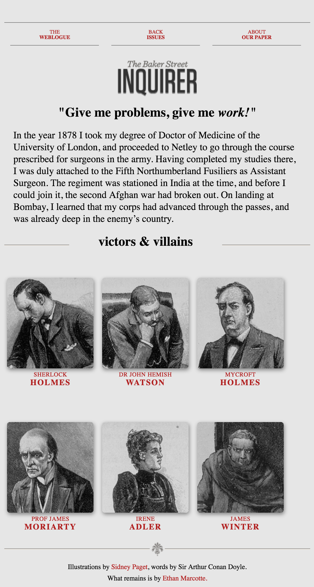

# _Project: Copy Baker Street Website_

#### By _**Megan Kaluza & Kyle Lange**_

See it live [HERE](https://kylelange.github.io/responsive/).

## Description

_This project is a PRACTICE page to work on responsive design using relative values and media query breakpoints. The site copied can be [found here](http://alistapart.com/d/responsive-web-design/ex/ex-site-FINAL.html#)_

_This webpage displays a form with bootstrap, divs, checkboxes, ids, classes, jQuery, JavaScript, functions, and CSS that initiate a survey to decide which remaining classes to take at Epicodus. My HTML and .js pages include comments to organize and continue building my webpage_

## Setup/Installation Requirements

* _Clone this repository https://github.com/megankaluza/responsive.git_ or
* _gem install sass_
* _sass styles.scss_
* _sass --watch ._

## Known Bugs

_No known bugs at this time. Please send an ISSUE on github in the repository if you see something we have not._

## Support and contact details

Contact Megan [here.](megan.kaluza@gmail.com)

Contact Kyle [here.](baronsintrees@gmail.com)

## Technologies Used

* _HTML_
* _CSS_
* _Sass_

### License

Copyright (c) 2016 **_Megan Kaluza and Kyle Lange_**

This software is licensed under the MIT license.

Permission is hereby granted, free of charge, to any person obtaining a copy of this software and associated documentation files (the "Software"), to deal in the Software without restriction, including without limitation the rights to use, copy, modify, merge, publish, distribute, sublicense, and/or sell copies of the Software, and to permit persons to whom the Software is furnished to do so, subject to the following conditions:

The above copyright notice and this permission notice shall be included in all copies or substantial portions of the Software.

THE SOFTWARE IS PROVIDED "AS IS", WITHOUT WARRANTY OF ANY KIND, EXPRESS OR IMPLIED, INCLUDING BUT NOT LIMITED TO THE WARRANTIES OF MERCHANTABILITY, FITNESS FOR A PARTICULAR PURPOSE AND NONINFRINGEMENT. IN NO EVENT SHALL THE AUTHORS OR COPYRIGHT HOLDERS BE LIABLE FOR ANY CLAIM, DAMAGES OR OTHER LIABILITY, WHETHER IN AN ACTION OF CONTRACT, TORT OR OTHERWISE, ARISING FROM, OUT OF OR IN CONNECTION WITH THE SOFTWARE OR THE USE OR OTHER DEALINGS IN THE SOFTWARE.
